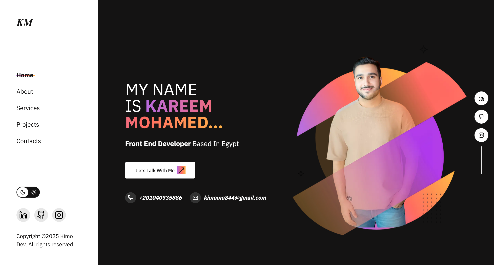

# Kimo Dev Portfolio

A modern, responsive developer portfolio built with **Next.js 15**, **React 19**, and **Tailwind CSS 4**. This project showcases the work, skills, and experience of Kareem Mohamed (Kimo), a passionate Frontend Developer from Cairo, Egypt.



---

## 🚀 Overview

This portfolio highlights personal projects, professional experience, and skills in web development. It is designed for performance, accessibility, and a great user experience across devices.

---

## ✨ Features

- **Landing Page** with animated hero section
- **Projects Showcase** with live demo and GitHub links
- **Skills & Technologies** section
- **Experience Timeline**
- **Contact Form** (integrated via EmailJS)
- **Dark/Light Theme Toggle**
- **Responsive Design**
- **Modern UI/UX**

---

## 🛠️ Tech Stack

- [Next.js 15](https://nextjs.org/)
- [React 19](https://react.dev/)
- [Tailwind CSS 4](https://tailwindcss.com/)
- [TypeScript](https://www.typescriptlang.org/)
- [Radix UI](https://www.radix-ui.com/)
- [EmailJS](https://www.emailjs.com/) (contact form)
- [Zod](https://zod.dev/) (validation)
- [Lucide React](https://lucide.dev/)

---

## 📦 Getting Started

Clone the repository and install dependencies:

```bash
git clone https://github.com/Kimo-Mo/kimo-dev-portfolio.git
cd kimo-dev-portfolio
pnpm install # or npm install / yarn install
```

Run the development server:

```bash
pnpm dev # or npm run dev / yarn dev
```

Open [http://localhost:3000](http://localhost:3000) to view the app.

---

## 🗂️ Project Structure

```
├── public/               # Static assets (images, icons)
├── src/
│   ├── app/              # Next.js app directory
│   ├── components/       # UI and layout components
│   ├── lib/              # Utilities
│   ├── services/data/    # Data (projects, skills, personal info)
│   └── ...
├── package.json
└── README.md
```

---

## 🏆 Projects Showcase

### [Forever E-commerce](https://forever-ecommerce-mocha.vercel.app/)

A fully functional e-commerce platform built with React.js, Bootstrap, and Firebase. Features product listing, search, cart, checkout, and authentication. [GitHub](https://github.com/Kimo-Mo/forever-ecommerce)

### [Exclusive E-commerce](https://exclusive-ecommerce-pearl.vercel.app/)

Responsive e-commerce website using HTML5, Tailwind CSS, JavaScript, and Firebase. Includes cart, wishlist, authentication, and animated UI. [GitHub](https://github.com/Kimo-Mo/Exclusive-ecommerce)

---

## 💼 Experience

- **Buguard** (Frontend Developer, Intern) — Jul 2025 - Present
- **ITI** (Frontend Developer, Intern) — Jul 2024 - Sep 2024
- **Freelance** (Frontend Developer) — 2022 - Present

---

## 📬 Contact

- **Name:** Kareem Mohamed
- **Location:** Cairo, Egypt
- **Email:** kimomo844@gmail.com
- **LinkedIn:** [linkedin.com/in/kareem-dev](https://www.linkedin.com/in/kareem-dev/)
- **GitHub:** [github.com/kimo-mo](https://github.com/kimo-mo)
- **Instagram:** [@kareem_mohamed_19](https://www.instagram.com/kareem_mohamed_19/)

---

## 🙏 Credits

- Built and implemented by Kareem Mohamed
- Inspired by modern developer portfolio best practices
- Icons by [Lucide](https://lucide.dev/) and [Iconsax](https://iconsax.io/)
- Design by ([Fawzy UI](https://www.figma.com/design/1uWab08g2jgbZjYFfahpC1/Portfolio%7C-Personal-Portfolio-%7C-5---Community-?node-id=0-1&t=KIfSqRrQrSZBZzyU-0))

---

## 📄 License

This project is licensed under the MIT License.
